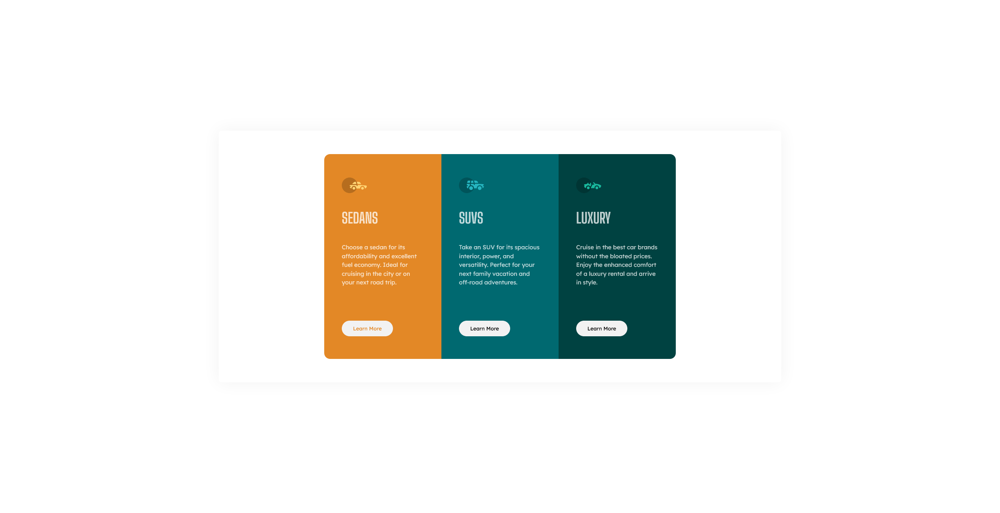
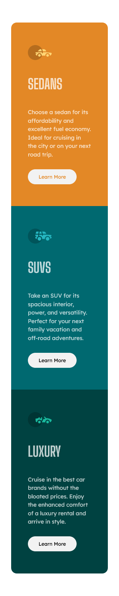

# Frontend Mentor - 3-column preview card component solution

This is a solution to the [3-column preview card component challenge on Frontend Mentor](https://www.frontendmentor.io/challenges/3column-preview-card-component-pH92eAR2-).

## Table of contents

- [Overview](#overview)
  - [The challenge](#the-challenge)
  - [Screenshot](#screenshot)
  - [Links](#links)
- [My process](#my-process)
  - [Built with](#built-with)
  - [What I learned](#what-i-learned)
  - [Continued development](#continued-development)
- [Author](#author)

## Overview

### The challenge

Users should be able to:

- View the optimal layout depending on their device's screen size
- See hover states for interactive elements

### Screenshots




### Links

- Solution URL: [Add solution URL here](https://www.frontendmentor.io/solutions/3column-preview-card-Ge8cYSOg7)
- Live Site URL: [Add live site URL here](https://reinerb.github.io/frontendmentor-projects/3-column-preview-card-component-main/index.html)

## My process

### Built with

- CSS custom properties
- Flexbox
- CSS Grid
- Mobile-first workflow

### What I learned

This project reinforced mobile-first development for me - and definitely expanded my knowledge of the `@media` tag. I found that the breakpoint for the columns looking correct was around 1000px width.

```css
@media only screen and (min-width: 1000px) {
  ...;
}
```

Up until this point, my code has usually been quick-and-dirty stuff, so setting up custom properties was usually unnecessary. I finally forced myself to use them in this project, and they were very useful - especially since I find `hsl` values to be difficult to remember.

```css
:root {
  --clr-primary-100: hsl(179, 100%, 13%);
  --clr-primary-300: hsl(184, 100%, 22%);
  --clr-primary-900: hsl(31, 77%, 52%);

  --clr-neutral-400: hsl(0, 0%, 95%);
  --clr-neutral-300: hsla(0, 0%, 100%, 0.75);
}
```

### Continued development

There is probably a cleaner way to invert the colors on each button on click. What I've done seems to work well enough, though:

```css
.column button:active {
  background-color: transparent;
  color: var(--clr-neutral-400);
  outline: none;
}
```

This design might look nice with some animations or some other responses on the columns on hover.

## Author

- Frontend Mentor - [@reinerb](https://www.frontendmentor.io/profile/reinerb)
